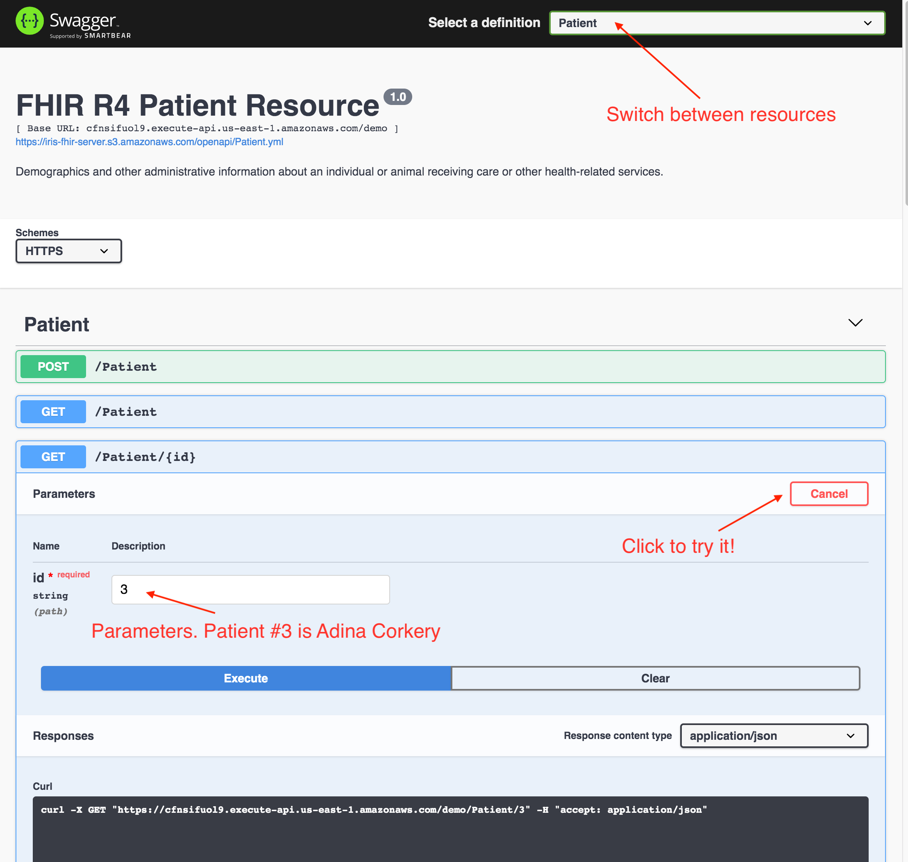

# Swagger-IRIS-FHIR
Swagger-UI frontend for InterSystems IRIS FHIR server. This is a single page Development Portal, based on swagger-ui project, exposing InterSystems IRIS FHIR server.

FHIR Resources API definitions are based on https://github.com/intersystems-community/FHIRServer

Reference deployment: https://iris-fhir-server.s3.amazonaws.com/swagger-ui.html



## Customization

You can customize path to the Open API Resource definitions in the `index.html` and API endpoint for each of the resources in the resource definitions:
```
host: cfnsifuol9.execute-api.us-east-1.amazonaws.com
basePath: /demo
schemes:
  - https
```
Note: `basePath` should NOT inslude the resource itself. For instance, if your Patient resource is located at:

http://localhost:52773//csp/healthshare/fhirserver/fhir/r4/Patient

the resource configuration section should look like:
```
host: localhost:52773
basePath: /csp/healthshare/fhirserver/fhir/r4
schemes:
  - http
```

Swagger-ui https://swagger.io/tools/swagger-ui/